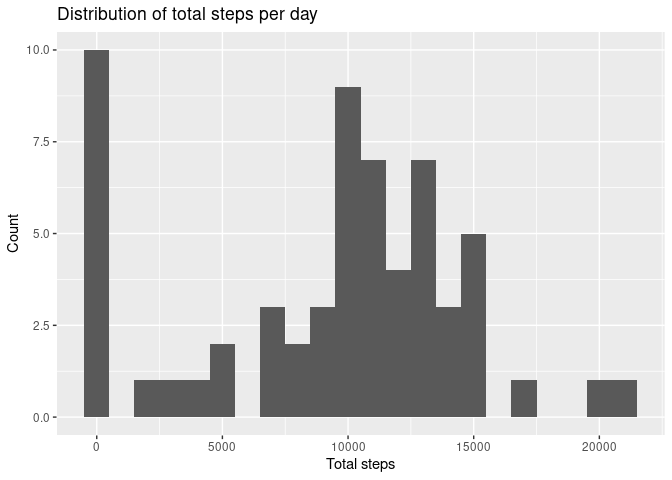
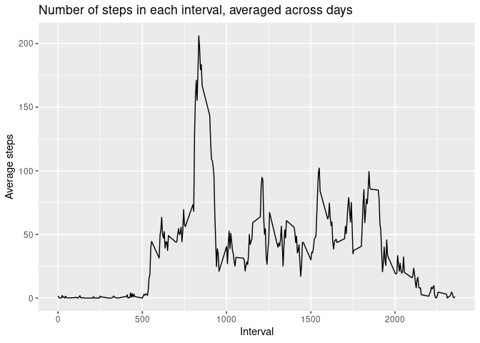

## Loading required libraries


```r
library(dplyr)
library(ggplot2)
library(lubridate)

# disable messages
knitr::opts_chunk$set(message = FALSE)
```

## Loading and preprocessing the data


```r
unzip("activity.zip", exdir = "data")
activity <- read.csv("data/activity.csv") %>% as_tibble()
activity <- activity %>% mutate(date = ymd(date))
head(activity)
```

```
## # A tibble: 6 x 3
##   steps date       interval
##   <int> <date>        <int>
## 1    NA 2012-10-01        0
## 2    NA 2012-10-01        5
## 3    NA 2012-10-01       10
## 4    NA 2012-10-01       15
## 5    NA 2012-10-01       20
## 6    NA 2012-10-01       25
```
The dates are parsed according to YYYY-MM-DD format.

## What is mean total number of steps taken per day?


```r
# get total steps per day
steps_by_day <- activity %>% 
    group_by(date) %>% 
    summarise(total_steps = sum(steps, na.rm = TRUE))

mean_daily_steps <- mean(steps_by_day$total_steps)
median_daily_steps <- median(steps_by_day$total_steps)

steps_by_day %>% ggplot(aes(x = total_steps)) +
    geom_histogram(binwidth = 1000) +
    labs(x = "Total steps", y = "Count",
         title = "Distribution of total steps per day")
```

<!-- -->

**Mean** total number of steps taken per day = **9354.2295082** \
**Median** total number of steps taken per day = **10395**

## What is the average daily activity pattern?


```r
# get the average number of steps per interval, across all days
steps_by_interval <- activity %>% 
    group_by(interval) %>% 
    summarise(avg_steps = mean(steps, na.rm = TRUE))

max_steps_interval <- steps_by_interval %>%
    filter(avg_steps == max(avg_steps)) %>% 
    pull(interval)

steps_by_interval %>% ggplot(aes(x = interval, y = avg_steps)) +
    geom_line() +
    labs(x = "Interval", y = "Average steps",
         title = "Number of steps in each interval, averaged across days")
```

<!-- -->

On average, the interval **835** contains the **maximum**
number of steps.

## Imputing missing values


```r
missing_values_count <- sum(is.na(activity$steps))

# get the average steps for a given interval
mean_interval_steps = function(req_interval) {
    avg_interval_steps <- steps_by_interval %>% 
        filter(interval == req_interval) %>% 
        pull(avg_steps)
    return(round(avg_interval_steps))
}

complete_activity <- activity %>%  mutate(
    steps = ifelse(is.na(steps), sapply(interval, mean_interval_steps), steps)
)

head(complete_activity)
```

```
## # A tibble: 6 x 3
##   steps date       interval
##   <dbl> <date>        <int>
## 1     2 2012-10-01        0
## 2     0 2012-10-01        5
## 3     0 2012-10-01       10
## 4     0 2012-10-01       15
## 5     0 2012-10-01       20
## 6     2 2012-10-01       25
```
The original dataset contained a total of **2304** missing
observations. Each missing observation is replaced with the rounded average
number of steps taken for the corresponding interval in `complete_activity`.

## Are there differences in activity patterns between weekdays and weekends?
