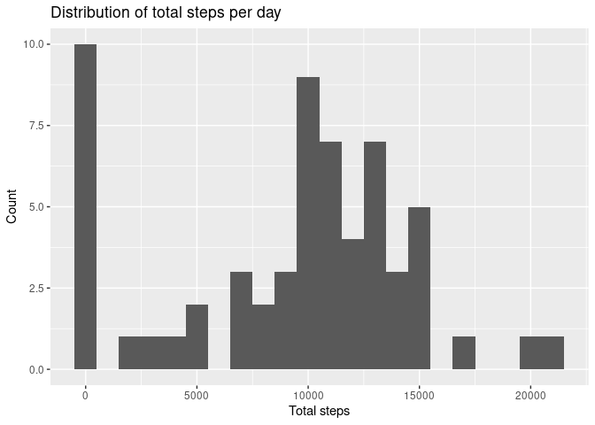

## Loading required libraries


```r
library(dplyr)
library(lubridate)
library(ggplot2)

# disable messages
knitr::opts_chunk$set(message = FALSE)
```

## Loading and preprocessing the data


```r
unzip("activity.zip", exdir = "data")
activity <- read.csv("data/activity.csv") %>% as_tibble()
activity <- activity %>% mutate(date = ymd(date))
head(activity)
```

```
## # A tibble: 6 x 3
##   steps date       interval
##   <int> <date>        <int>
## 1    NA 2012-10-01        0
## 2    NA 2012-10-01        5
## 3    NA 2012-10-01       10
## 4    NA 2012-10-01       15
## 5    NA 2012-10-01       20
## 6    NA 2012-10-01       25
```
The dates are parsed according to YYYY-MM-DD format.

## What is mean total number of steps taken per day?


```r
# get total steps per day
steps_by_day <- activity %>% 
    group_by(date) %>% 
    summarise(total_steps = sum(steps, na.rm = TRUE))

mean_daily_steps <- mean(steps_by_day$total_steps)
median_daily_steps <- median(steps_by_day$total_steps)

steps_by_day %>% ggplot(aes(x = total_steps)) +
    geom_histogram(binwidth = 1000) +
    labs(x = "Total steps", y = "Count",
         title = "Distribution of total steps per day")
```

<!-- -->

**Mean** total number of steps taken per day = **9354.2295082** \
**Median** total number of steps taken per day = **10395**

## What is the average daily activity pattern?


## Imputing missing values


## Are there differences in activity patterns between weekdays and weekends?
